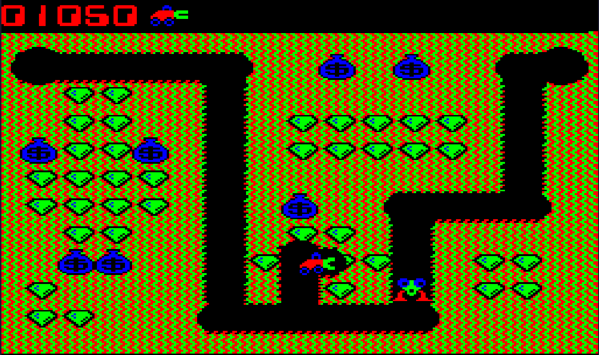

# Порт игры Digger (Windmill Software Inc.) для компьютера Электроника БК-0010



Одной из целей проекта была возможность показать, что для создания программ, в том числе игр,
для компьютера Электроника  БК-0010 можно использовать современный компилятор языка Си, такой, как gcc.

Для сборки проекта понадобится кросс-компилятор gcc для архитектуры DEC PDP-11/10 с небольшой доработкой.

## Инструкция по сборке кросс-компилятора **gcc** для процессора **КР1801ВМ1** под ОС Linux

Для настройки кросс-компилятора gcc для процессора **КР1801ВМ1** понадобятся свежие исходники компилятора gcc,
которые можно взять с **ftp.gnu.org** из папки [gcc](https://ftp.gnu.org/gnu/gcc/) и свежие исходники *binutils*,
которые можно найти в папке [binutils](https://ftp.gnu.org/gnu/binutils/)

На момент написания это были версии **gcc-14.2.0** и **binutils-2.43**.

Сначала, создаём папку, в которую будем скачивать компилятор и *binutils* и заходим в эту папку:
```
mkdir -p gcc-KP1801BM1/src
cd gcc-KP1801BM1/src
```
Скачиваем в эту папку архивы с исходниками *gcc* и *binutils*, например так:
```
wget https://ftp.gnu.org/gnu/gcc/gcc-14.2.0/gcc-14.2.0.tar.gz
wget https://ftp.gnu.org/gnu/binutils/binutils-2.43.tar.gz
```

Распаковываем архивы с *gcc* и *binutils*:
```
tar -xvzf gcc-14.2.0.tar.gz
tar -xvzf binutils-2.43.tar.gz
```

Заходим в папку *gcc-14.2.0* и запускаем скрипт *./contrib/download_prerequisites*
```
cd gcc-14.2.0
./contrib/download_prerequisites
```

Скачиваем туда же и применяем [патч](https://github.com/prcoder-1/digger-bk0010/raw/refs/heads/main/gcc-KP1801BM1.patch) для получения возможности использования компилятором команд процессора **sob и xor**, которые присутсвуют в процессоре **КР1801ВМ1**, но отсутствуют в **DEC PDP-11/10**:
```
wget https://github.com/prcoder-1/digger-bk0010/raw/refs/heads/main/gcc-KP1801BM1.patch
patch -p1 < gcc-KP1801BM1.patch
```

Выходим снова в папку *gcc-KP1801BM1* и создаём там папку *build*, входим в неё и создаём папки для сборки компилятора и *binutils*:
```
cd ../..
mkdir build
cd build
mkdir gcc
mkdir binutils
```

Заходим в папку **binutils** и конфигурируем *binutils*:
```
cd binutils
../../src/binutils-2.43/configure --prefix $HOME/xgcc --bindir $HOME/bin --target pdp11-aout
```

В этой команде после параметра **--prefix** указан путь на папку с файлами кросс-компилятора, где будут находиться папки *include*, *lib* и т.д. кросскомпилятора.
В данном случае папка кросс компилятора будет расположена в домашней директории в папке *xgcc*.

После параметра **--bindir** указан путь куда будут помещены исполняемые файлв кросс-компилятора.
В данном случае использована папка *bin* в домашней папке пользователя.

Далее, собираем *binutils* и, за тем, устанавливаем его по пути указанном в предыдущей команде:
```
make -j7
make install
```

Параметр **-j7** после make указывает на то, что для сборки будут использованы семь ядер компьютера.
Имеет смысл указывать количество на одно ядро меньшее, чем присутствует в компьютере для избежания зависаний ОС во время сборки.

Далее, выходим из этой папке и таким же образом конфигурируем *gcc* войдя в папку **gcc*(:
```
cd ../gcc
../../src/gcc-14.2.0/configure --prefix $HOME/xgcc --bindir $HOME/bin --target pdp11-aout --enable-languages=c --with-gnu-as --with-gnu-ld --without-headers --disable-libssp
```

За тем, собираем *gcc* и устанавливаем его:
```
make -j7
make install
```

В результате этого процесса, после инсталляции, в папке **bin** *домашней папки* должны появится запускаемые файл компилятора, такие как **pdp11-aout-gcc**, **pdp11-aout-as**, а в папке **xgcc** (тоже в домашней папке) должны появится папки **include**, **lib**, **pdp11-aout** и др.

В папку **include** папки **xgcc** необходимо поместить файл **stdint.h**, который можно скачать отсюда:
[stdint.h](https://github.com/prcoder-1/digger-bk0010/raw/refs/heads/main/stdint.h)

В нём находятся описания 8-ми, 16-ти и 32-битных целых типов данных необходимые для сборки проекта.

## Сборка проекта Digger для компьютера Электроника БК-0010

В проекте используется система сборки **make**. При наличии установленного компилятора **pdp11-aout-gcc** для сборки проекта достаточно запустить утилиту **make** в папке с проектом:
```
make
```

В результате работы **make** должен получиться запускаемый файл **digger.bin**.

Все настройки сборки проекта находятся в файле **Makefile**.

Секция **asm-file** - отладочная. В ней из некоторых файлов на языке Си гененрируются файлы на языке ассемблер (файлы с расширением **.s**).
Сделано это с целью отладки, чтобы можно было посмотреть какой ассмеблерный код получается из сишного.
Для сборки запускаемого бинарного файла эта секций не требуется.

Секция **crt0** создаёт маленький объектный файл с точкой входа с программу.
Этот файл нужн для того, чтобы при запуске программы с адреса загрузки запустилась функция main() языка Cи.

Секция **aout2bin** создаёт одноимённую вспомогательную программу для создания файла **.bin** из файла **a.out**.
Она разбирает структуру файла **a.out** и создаёт необходимый заголовок для файла **.bin**.
Для сборки этой утилиты необходимо, чтобы в системе был установлен компилятор **gcc** (обычный, не кросс).

Секция **libs** собирает различные процедуры (вывод спрайтов, вывод звука, случайное число, задержка, работа с памятью) в библиотеку для дальнейшего использования по мере необходимости.

## Файлы проекта
- digger.c - основной файл проекта в котором реализована логика игры
- digger_levels.c - файл с закодированными уровнями игры
- digger_sprites.c - файл со спрайтами
- digger_font.c - файл со шрифтом
- digger_music.c - файл с музыкой (сейчас не используется, используется только заголовок .h от него)
- sprites.c - процедуры вывода спрайтов
- sound.c - процедуры вывода звука
- tools.c - дополнительные методы, такие как получение псевдо-случайного числа, задержка, конвертация числа в строку и т.д.
- memory.h - файл с описанием карты памяти БК-0010 и основных регистров управления
- memory.s - реализация подпрограммы _memset для внуренних целей компилятора
- emt.h - описания функций для вызова основных EMT
- divmulmod.s - реализация целочисленного деления, деления по-модулю, остатка от деления (в проекте digger в данный момент не используется и отключена)
- a.out.ld - скрипт для линковщика в котором описано распределение доступной памяти и расположение секций (код программы, данные, неинициализированные данные)
- aout2bin.c - цтилита для преобразования файлов a.out в файлы .bin


## Сборка документации

В проекте предусмотрена автоматическая сборка документации при помощи утилиты **doxygen**.
Для генерации документации достаточно просто запустить эту утилиту:
```
doxygen
```

## Запуск для отладки на БК-0010 при помощи *Gryphon-MPI*

Для удобства отладки в проекте предусмотрен запуск скомпилированного файла на компьютере БК-0010 при помощи [**Gryphon-MPI**](https://night-gryphon.ru/Gryphon-MPI/).
Запуск осуществляется при помощи сборки цели проекта *g-mpi*.
Цель использует утилиту ***curl*** для связи с **Gryphon-MPI**, передачи и запуска скомпилированного файла.

Цель состоит из двух команд:
```
curl -i -o /dev/null -X POST -H "Content-Type: multipart/form-data" -F "storeas=${GMPI_UPLOAD_DIR}/${BIN_FILE}" -F "size=$(shell stat -c%s ${BIN_FILE})" -F "file=@${BIN_FILE}" "${GMPI_API_URL}/upload"
```
Где в переменной *GMPI_UPLOAD_DIR* содержится путь в файловой системе **Gryphon-MPI** по которому будет размещён файл, а *BIN_FILE* - имя двоичного файла.
В переменной *GMPI_API_URL* содержится путь на API **Gryphon-MPI**. Для определения размера передаваемого файла используется утилита ***stat***.

Команда передаёт HTTP запрос POST с указанием имени передваемого файла и места в файловой системе **Gryphon-MPI** в котором будет размещён бинарный файл.


Вторая команда:
```
curl -i -s -o /dev/null "${GMPI_API_URL}/run?dev=file&emu10=no&fname=${GMPI_UPLOAD_DIR}/${BIN_FILE}"
```

Осуществляет запуск переданного файла с использованием API **Gryphon-MPI**.
